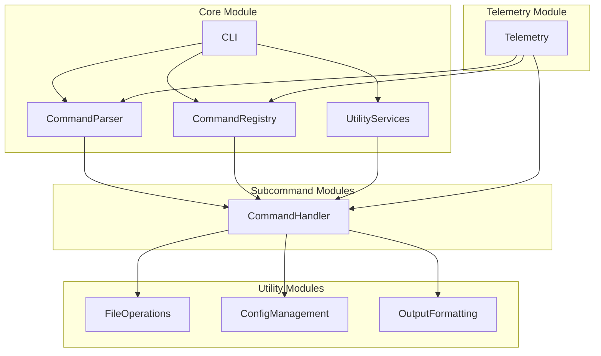

```mermaid
graph TD
    CLI --> CommandParser
    CLI --> CommandRegistry
    CLI --> UtilityServices

    CommandParser --> CommandHandler
    CommandRegistry --> CommandHandler
    UtilityServices --> CommandHandler

    CommandHandler --> FileOperations
    CommandHandler --> ConfigManagement
    CommandHandler --> OutputFormatting

    Telemetry --> CommandParser
    Telemetry --> CommandRegistry
    Telemetry --> CommandHandler

    subgraph Core Module
        CLI
        CommandParser
        CommandRegistry
        UtilityServices
    end

    subgraph Subcommand Modules
        CommandHandler
    end

    subgraph Utility Modules
        FileOperations
        ConfigManagement
        OutputFormatting
    end

    subgraph Telemetry Module
        Telemetry
    end
```