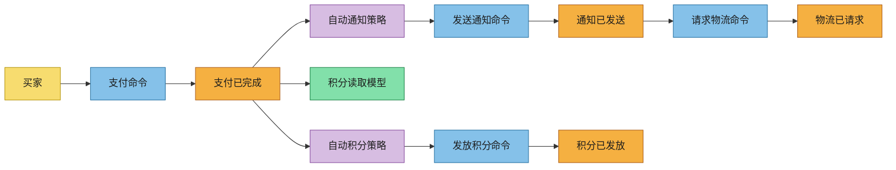
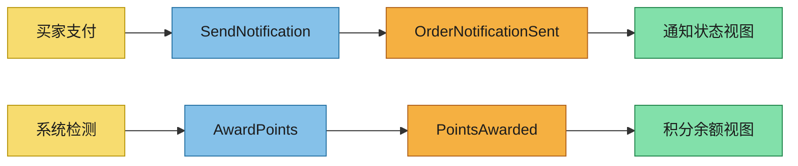

# 基于 OpenSpec 的 Event-Driven 实践指南

## 前言：从理论到实践

上一份文档（`01-what-is-event-driven.md`）讲解了事件驱动的理论基础。本指南聚焦于**如何基于 OpenSpec 的 Event-Driven Schema 完成从需求发现到实施规划**的完整工作流。

OpenSpec 的 Event-Driven Schema 定义了一个严格的阶段门（Stage Gate）流程：

```
Event Storming → Event Modeling → Specs → Design → AsyncAPI → Tasks → 实施
```

每个阶段必须在上一个阶段完成后才能开始，确保决策质量。

---

## 第一章：OpenSpec Event-Driven Schema 工作流总览

### 1.1 工作流阶段与产物

| 阶段 | 产物文件 | 关键产出 | 前置依赖 |
|------|---------|---------|-----------|
| 1. 事件风暴 | `event-storming.md` | 领域事件、命令、参与者、边界 | 无 |
| 2. 事件建模 | `event-modeling.md` | 结构化事件流、泳道图 | 阶段 1 完成 |
| 3. 规范编写 | `specs/**/*.md` | 用户故事 + 验收标准 | 阶段 2 完成 |
| 4. 技术设计 | `design.md` | 架构决策、安全策略 | 阶段 3 完成 |
| 5. AsyncAPI 编写 | `asyncapi.yaml` | 验证通过的 API 合同 | 阶段 4 完成 |
| 6. 任务规划 | `tasks.md` | 依赖排序的实施清单 | 阶段 5 完成 |

### 1.2 阶段门规则

- **Event Modeling 必须基于 Event Storming 的输出**
- **Specs 和 Design 完成之前，不能开始 AsyncAPI**
- **Tasks 规划前，Specs 和 Design 必须通过审查，AsyncAPI 必须验证通过**
- **AsyncAPI 验证命令**：`asyncapi-cli validate asyncapi.yaml`

### 1.3 Mermaid 颜色规范

在所有产物中使用统一的颜色编码：

```mermaid
classDef actor fill:#F7DC6F,stroke:#B7950B,color:#1C1C1C
classDef command fill:#85C1E9,stroke:#2471A3,color:#1C1C1C
classDef event fill:#F5B041,stroke:#AF601A,color:#1C1C1C
classDef policy fill:#D7BDE2,stroke:#884EA0,color:#1C1C1C
classDef readModel fill:#82E0AA,stroke:#1E8449,color:#1C1C1C
```

---

## 第二章：完整示例 —— 订单通知系统

### 场景描述

一家电商公司需要构建一个**订单通知系统**：当订单支付成功后，系统需要自动发送订单确认邮件、触发物流跟踪、更新用户积分。

### 阶段 1：事件风暴（event-storming.md）

```markdown
# 事件风暴 —— 订单通知系统

## 范围与目标
- 领域：订单支付后的通知和后续处理
- 期望成果：订单支付成功后自动触发相关后续流程
- 范围：支付完成 → 通知 → 物流 → 积分
- 非范围：订单创建、支付处理本身

## 参与者
- 主要用户：买家（Customer）、卖家（Seller）
- 外部系统：邮件服务（Email Service）、物流平台（Shipping Platform）
- 自动化代理：积分服务（Loyalty Service）

## 领域事件（过去时态）
- **PaymentCompleted（支付已完成）**
  - 触发原因：买家完成支付
  - 产生的数据：orderId, amount, paymentMethod, timestamp
  - 业务影响：订单进入处理状态

- **OrderNotificationSent（订单通知已发送）**
  - 触发原因：收到 PaymentCompleted
  - 产生的数据：orderId, notificationType, recipient
  - 业务影响：用户收到确认信息

- **ShippingRequested（物流已请求）**
  - 触发原因：通知发送成功
  - 产生的数据：orderId, shippingAddress, items
  - 业务影响：物流开始处理

- **PointsAwarded（积分已发放）**
  - 触发原因：支付完成
  - 产生的数据：userId, points, reason
  - 业务影响：用户积分更新

## 命令
- **SendNotification（发送通知）**
  - 发出者：订单服务
  - 目标：通知聚合
  - 前置条件：PaymentCompleted 事件存在
  - 期望事件：OrderNotificationSent

- **RequestShipping（请求物流）**
  - 发出者：订单服务
  - 目标：物流聚合
  - 前置条件：OrderNotificationSent 事件存在
  - 期望事件：ShippingRequested

- **AwardPoints（发放积分）**
  - 发出者：自动化策略
  - 目标：积分聚合
  - 前置条件：PaymentCompleted 事件存在
  - 期望事件：PointsAwarded

## 聚合 / 限界上下文
- **订单聚合（Order）**
  - 职责：管理订单状态流转
  - 不变量：订单状态必须按序变化
  - 所属数据：订单详情、支付状态

- **通知聚合（Notification）**
  - 职责：管理通知发送状态
  - 不变量：每条通知有唯一发送记录
  - 所属数据：通知记录、发送状态

## 自动化 / 策略
- **支付后自动通知策略**
  - 触发事件：PaymentCompleted
  - 发出命令：SendNotification
  - 失败处理：重试 3 次后进入 DLQ

- **自动积分策略**
  - 触发事件：PaymentCompleted
  - 发出命令：AwardPoints
  - 失败处理：记录日志，异步补偿

## 时间线图（Mermaid）


## 热点与待解决问题
- **热点**：邮件服务宕机时通知可能延迟 → 需要重试 + DLQ 机制
- **风险**：积分计算逻辑复杂，可能有竞态条件 → 需要幂等保护
- **待决策**：通知和积分是同步还是异步执行？

## 交付至下游产物
- `event-modeling.md`：将上述流程转化为结构化泳道
- `specs/**/*.md`：为用户故事编写验收标准
- `design.md`：决定消息代理和重试策略
- `asyncapi.yaml`：定义事件通道和消息结构
```

### 阶段 2：事件建模（event-modeling.md）

```markdown
# 事件建模 —— 订单通知系统

每个场景使用泳道顺序：`触发器 → 命令 → 事件 → 读取模型`

## 场景 1：支付后发送通知

### 触发器
- 人工触发：买家完成支付操作
- 输入信号：支付成功回调

### 命令
- 命令名称：SendNotification
- 目标聚合：通知聚合
- 验证规则：orderId 必须有效，recipient 邮箱格式正确

### 事件
- 事件名称：OrderNotificationSent
- 事件负载：{ orderId, notificationType, recipient, sentAt }
- 幂等说明：基于 orderId 去重

### 读取模型
- 投影：通知发送状态视图
- 消费者：订单 Dashboard、客服系统
- 支持的查询：按 orderId 查询通知状态

## 场景 2：支付后发放积分

### 触发器
- 系统触发：自动化策略检测到 PaymentCompleted 事件

### 命令
- 命令名称：AwardPoints
- 目标聚合：积分聚合
- 验证规则：userId 必须有效，积分数量 > 0

### 事件
- 事件名称：PointsAwarded
- 事件负载：{ userId, orderId, points, reason }
- 幂等说明：基于 orderId 去重

### 读取模型
- 投影：用户积分余额视图
- 消费者：用户个人中心、积分排行榜
- 支持的查询：按 userId 查询积分余额

## Mermaid 流程图

```

### 阶段 3：规范编写（specs/order-notification.md）

```markdown
## 新增用户故事

### 用户故事：支付后自动发送确认通知
作为买家，我想要在支付成功后收到确认通知，以便我知道订单正在处理中。

#### 验收标准
- **已知** 订单 #ORD-001 支付已完成
- **当** 系统处理 PaymentCompleted 事件
- **则** 向买家注册的邮箱发送确认邮件
- **则** 发送状态记录在通知视图中

### 用户故事：支付后自动发放积分
作为买家，我想要在支付成功后自动获得积分，以便我的会员权益得到体现。

#### 验收标准
- **已知** 订单 #ORD-001 支付已完成，金额为 100 元
- **当** 系统处理 PaymentCompleted 事件
- **则** 向买家账户发放 10 积分（1 元 = 0.1 积分）
- **则** 积分变动记录可查询

## 修改用户故事

### 用户故事：通知失败重试
作为系统管理员，我想要通知失败后自动重试，以避免手动干预。

#### 验收标准
- **已知** 邮件服务暂时不可用
- **当** 通知发送失败
- **则** 系统重试最多 3 次，间隔 5 秒、30 秒、5 分钟
- **则** 超过重试次数后事件进入死信队列
```

### 阶段 4：技术设计（design.md）

```markdown
## 上下文

基于事件风暴和事件建模产物，我们需要构建一个可靠的订单通知系统，支持自动重试和最终一致性。

## 目标 / 非目标

- 目标：可靠的通知投递、幂等的事件处理、可观测的事件链路
- 非目标：订单创建逻辑、支付网关集成

## 消息与平台决策

### 消息代理 / 运行时
- 选定：Apache Kafka
- 理由：高吞吐、持久化、支持消费者分组、成熟的运维生态
- 考虑过的方案：RabbitMQ（吞吐量不足）、AWS SNS/SQS（绑定云厂商）

### 主题命名
- 命名规范：`{domain}.{event-type}.{version}`
- 版本策略：事件结构变更时提升版本号
- 所有权：订单领域团队拥有 `order.*` 主题

### 负载格式
- 消息编码：JSON
- Schema 格式：JSON Schema，使用 Confluent Schema Registry 管理
- 兼容性：Backward + Forward 兼容

### 投递语义
- 预期：至少一次（At-least-once）
- 重试策略：指数退避（5s, 30s, 5min），最大 3 次
- 幂等策略：基于 eventId 去重，使用处理记录表

## 安全决策

- 认证：mTLS + SASL/SCRAM
- 授权：基于 ACL 的主题级别权限
- 敏感数据：订单金额使用 AES-256 加密

## 运维与可观测性

- 监控：Kafka 消费者延迟告警、DLQ 增长告警
- 链路追踪：每个事件携带 traceId 和 correlationId
- 容量：单分区 5000 msg/s 基准

## 交付至 AsyncAPI

- 通道：`order.payment.completed.v1`, `order.notification.sent.v1`, `loyalty.points.awarded.v1`
- 消息结构：PaymentCompleted, OrderNotificationSent, PointsAwarded
- 绑定：Kafka 分区策略、重试配置
- 安全：SASL/SCRAM 认证方案
```

### 阶段 5：AsyncAPI 编写（asyncapi.yaml）

```yaml
asyncapi: 3.0.0
info:
  title: 订单通知系统
  version: 1.0.0
  description: |
    订单支付后的通知和积分发放事件合同，基于事件风暴和设计决策编写。

defaultContentType: application/json

servers:
  production:
    host: kafka.internal:9092
    protocol: kafka
    description: 生产环境 Kafka 集群

channels:
  order.payment.completed.v1:
    address: order.payment.completed.v1
    messages:
      PaymentCompleted:
        $ref: '#/components/messages/PaymentCompleted'

  order.notification.sent.v1:
    address: order.notification.sent.v1
    messages:
      OrderNotificationSent:
        $ref: '#/components/messages/OrderNotificationSent'

  loyalty.points.awarded.v1:
    address: loyalty.points.awarded.v1
    messages:
      PointsAwarded:
        $ref: '#/components/messages/PointsAwarded'

operations:
  publishPaymentCompleted:
    action: send
    channel:
      $ref: '#/channels/order.payment.completed.v1'

  publishOrderNotificationSent:
    action: send
    channel:
      $ref: '#/channels/order.notification.sent.v1'

  publishPointsAwarded:
    action: send
    channel:
      $ref: '#/channels/loyalty.points.awarded.v1'

  subscribePaymentCompleted:
    action: receive
    channel:
      $ref: '#/channels/order.payment.completed.v1'

components:
  messages:
    PaymentCompleted:
      name: PaymentCompleted
      title: 支付已完成
      summary: 买家完成支付后发布的事件
      payload:
        $ref: '#/components/schemas/PaymentCompletedPayload'

    OrderNotificationSent:
      name: OrderNotificationSent
      title: 订单通知已发送
      summary: 确认通知成功发送后发布的事件
      payload:
        $ref: '#/components/schemas/OrderNotificationSentPayload'

    PointsAwarded:
      name: PointsAwarded
      title: 积分已发放
      summary: 用户积分成功增加后发布的事件
      payload:
        $ref: '#/components/schemas/PointsAwardedPayload'

  schemas:
    PaymentCompletedPayload:
      type: object
      required: [orderId, userId, amount, paymentMethod, timestamp]
      properties:
        orderId:
          type: string
          format: uuid
        userId:
          type: string
          format: uuid
        amount:
          type: number
          format: double
        paymentMethod:
          type: string
          enum: [alipay, wechat, creditCard, debitCard]
        timestamp:
          type: string
          format: date-time

    OrderNotificationSentPayload:
      type: object
      required: [orderId, notificationType, recipient, sentAt]
      properties:
        orderId:
          type: string
          format: uuid
        notificationType:
          type: string
          enum: [email, sms, push]
        recipient:
          type: string
        sentAt:
          type: string
          format: date-time

    PointsAwardedPayload:
      type: object
      required: [userId, orderId, points, reason]
      properties:
        userId:
          type: string
          format: uuid
        orderId:
          type: string
          format: uuid
        points:
          type: integer
        reason:
          type: string
        awardedAt:
          type: string
          format: date-time

  securitySchemes:
    kafkaSasl:
      type: scramSha512
```

**验证：**
```bash
$ asyncapi-cli validate asyncapi.yaml
# Success! No errors found.
```

### 阶段 6：任务规划（tasks.md）

```markdown
## 1. 基础设施准备

- [ ] 1.1 在 Kafka 集群创建 3 个主题（payment.completed, notification.sent, points.awarded），各 3 分区
- [ ] 1.2 在 Schema Registry 注册 3 个事件 Schema
- [ ] 1.3 配置 DLQ 主题和告警规则

## 2. 事件生产者

- [ ] 2.1 实现 PaymentCompleted 事件生产者（含 Schema 验证）
- [ ] 2.2 实现 OrderNotificationSent 事件生产者
- [ ] 2.3 实现 PointsAwarded 事件生产者
- [ ] 2.4 编写生产者单元测试（含失败场景）

## 3. 通知消费者

- [ ] 3.1 实现 PaymentCompleted 消费者
- [ ] 3.2 集成邮件发送服务
- [ ] 3.3 实现重试逻辑（指数退避，最大 3 次）
- [ ] 3.4 实现幂等保护（基于 orderId 去重）
- [ ] 3.5 编写消费者集成测试

## 4. 积分消费者

- [ ] 4.1 实现 PaymentCompleted → AwardPoints 消费者
- [ ] 4.2 集成积分服务
- [ ] 4.3 实现幂等保护（基于 orderId 去重）
- [ ] 4.4 编写消费者集成测试

## 5. 读取模型

- [ ] 5.1 实现通知状态投影（OrderNotificationSent → 通知状态视图）
- [ ] 5.2 实现积分余额投影（PointsAwarded → 用户积分视图）
- [ ] 5.3 添加查询 API

## 6. 可观测性

- [ ] 6.1 添加结构化日志（含 traceId、correlationId）
- [ ] 6.2 配置消费者延迟监控
- [ ] 6.3 配置 DLQ 告警
- [ ] 6.4 添加 OpenTelemetry 追踪

## 7. 发布与验证

- [ ] 7.1 端到端集成测试（使用测试 Kafka 集群）
- [ ] 7.2 性能测试（验证吞吐量目标）
- [ ] 7.3 灰度发布（5% → 50% → 100%）
- [ ] 7.4 发布后验证
```

---

## 第三章：完整示例 —— 物联网传感器告警系统

### 场景描述

一家智能工厂有数百台设备，每台设备实时产生传感器数据（温度、振动、湿度）。当传感器数值超过阈值时，系统需要自动生成告警工单、通知运维人员、并触发预防性维护流程。

### 阶段 1：事件风暴（event-storming.md）

```markdown
# 事件风暴 —— 物联网传感器告警系统

## 范围与目标
- 领域：工业设备实时监控和告警
- 期望成果：设备异常时自动告警和触发维护
- 范围：传感器数据 → 异常检测 → 告警 → 工单 → 维护

## 参与者
- 主要用户：设备（Sensor）、运维工程师（Engineer）、系统管理员
- 外部系统：短信/邮件网关、工单系统（Jira/ServiceNow）
- 自动化代理：异常检测引擎、告警策略引擎

## 领域事件
- **SensorDataReceived（传感器数据已接收）**
  - 触发原因：设备定时上报数据
  - 数据：deviceId, temperature, vibration, humidity, timestamp
  - 影响：数据进入分析管道

- **AnomalyDetected（异常已检测）**
  - 触发原因：数据超过阈值
  - 数据：deviceId, metric, value, threshold, severity
  - 影响：触发告警流程

- **AlertCreated（告警已创建）**
  - 触发原因：AnomalyDetected 事件
  - 数据：alertId, deviceId, severity, description
  - 影响：运维人员收到通知

- **WorkOrderCreated（工单已创建）**
  - 触发原因：严重告警自动升级
  - 数据：workOrderId, alertId, priority, assignee
  - 影响：维护任务开始

- **MaintenanceCompleted（维护已完成）**
  - 触发原因：工程师完成维护操作
  - 数据：workOrderId, resolution, duration
  - 影响：设备状态恢复正常

## 命令
- **CheckThreshold（检查阈值）**
  - 发出者：异常检测引擎
  - 前置条件：SensorDataReceived 事件存在
  - 期望事件：AnomalyDetected

- **CreateAlert（创建告警）**
  - 发出者：告警策略引擎
  - 前置条件：AnomalyDetected 事件
  - 期望事件：AlertCreated

- **CreateWorkOrder（创建工单）**
  - 发出者：自动化策略
  - 前置条件：AlertCreated + severity >= critical
  - 期望事件：WorkOrderCreated

## 聚合 / 限界上下文
- **设备聚合（Device）**：设备状态、传感器配置
- **告警聚合（Alert）**：告警生命周期管理
- **维护聚合（Maintenance）**：工单和维护记录

## 策略
- **阈值告警策略**：数据超过阈值 → 自动创建告警
- **告警升级策略**：严重告警 30 分钟未响应 → 自动创建工单
- **告警抑制策略**：同一设备 5 分钟内相同告警合并

## 时间线图

```

### 阶段 2-6 概要

遵循相同流程：

**阶段 2（事件建模）：** 定义核心泳道：`设备 → 数据接收 → 异常检测 → 告警创建 → 工单创建 → 维护完成`

**阶段 3（规范编写）：** 关键用户故事：
- 作为运维工程师，我想要在设备异常时收到即时告警，以便我能在故障扩大前介入
- 作为系统管理员，我想要同一告警 5 分钟内不重复发送，以避免告警风暴
- 作为工厂经理，我想要设备维护统计 Dashboard，以便我了解设备健康趋势

**阶段 4（技术设计）：** 关键决策：
- 消息代理：Apache Kafka（高吞吐、传感器数据量大）
- 阈值检测：流处理引擎（Flink/Spark Streaming）
- 告警抑制：Redis 滑动窗口去重
- 投递语义：至少一次 + 基于 eventId 幂等

**阶段 5（AsyncAPI）：** 关键通道：
- `device.sensor.data.v1`
- `device.anomaly.detected.v1`
- `device.alert.created.v1`
- `device.workorder.created.v1`
- `device.maintenance.completed.v1`

**阶段 6（任务规划）：**
```markdown
## 1. 基础设施

- [ ] 1.1 创建 Kafka 主题（5 个，各 12 分区，支持 10 万 msg/s）
- [ ] 1.2 部署 Schema Registry 和事件 Schema
- [ ] 1.3 配置 Redis 实例用于告警抑制

## 2. 数据管道

- [ ] 2.1 实现传感器数据生产者（支持 MQTT 接入）
- [ ] 2.2 实现流处理异常检测（Flink）
- [ ] 2.3 实现告警抑制逻辑（Redis 滑动窗口）

## 3. 告警处理

- [ ] 3.1 实现告警消费者
- [ ] 3.2 集成短信/邮件通知
- [ ] 3.3 实现告警升级策略（30 分钟超时自动升级）

## 4. 工单系统

- [ ] 4.1 集成工单系统 API
- [ ] 4.2 实现工单创建和分配逻辑

## 5. 读取模型

- [ ] 5.1 设备健康 Dashboard
- [ ] 5.2 告警统计视图
- [ ] 5.3 维护工单查询

## 6. 发布

- [ ] 6.1 模拟测试（100 台设备，10 万数据/分钟）
- [ ] 6.2 灰度上线（先接入 10% 设备）
- [ ] 6.3 全量上线
```

---

## 第四章：使用 OpenSpec CLI 实际操作

### 4.1 启动新的 Event-Driven 变更

```bash
# 1. 确认 schema 已激活
cat openspec/config.yaml
# 确认 schema: event-driven

# 2. 创建新变更
openspec new order-notification-system

# 3. 开始第一阶段：事件风暴
# OpenSpec 会自动生成 event-storming.md 模板
```

### 4.2 阶段推进

```bash
# 完成事件风暴后，继续到事件建模
openspec continue order-notification-system

# OpenSpec 会根据依赖关系提示下一个需要完成的阶段
# 事件风暴 → 事件建模 → 规范 → 设计 → AsyncAPI → 任务
```

### 4.3 验证 AsyncAPI

```bash
# 安装 asyncapi-cli
npm install -g @asyncapi/cli

# 验证 asyncapi.yaml
asyncapi-cli validate asyncapi.yaml
```

### 4.4 开始实施

```bash
# 所有阶段完成后，开始实施
openspec apply order-notification-system
```

### 4.5 验证与归档

```bash
# 验证实施是否完成
openspec verify order-notification-system

# 归档完成的变更
openspec archive order-notification-system
```

---

## 第五章：常见问题与最佳实践

### 5.1 常见问题

**Q: 事件风暴需要多长时间？**
A: Big Picture 工作坊通常 4-6 小时。Process Level 和 Design Level 各需要额外 2-4 小时。

**Q: 可以在没有领域专家的情况下做事件风暴吗？**
A: 理论上可以，但效果会大打折扣。领域专家的存在是事件风暴成功的关键。

**Q: AsyncAPI 必须使用吗？**
A: 对于需要多团队协作的事件驱动系统，AsyncAPI 强烈建议。对于简单的内部事件，可以直接使用代码注释。

**Q: 如何处理事件版本升级？**
A: 使用事件名称版本化（`v1`, `v2`），旧版本和新版本主题并存，逐步迁移消费者。

### 5.2 最佳实践清单

- [ ] 事件名称使用过去时态（`OrderPlaced` 而非 `PlaceOrder`）
- [ ] 每个事件包含 eventId、timestamp 和 source（来源标识）
- [ ] 消费者必须实现幂等性
- [ ] 所有生产队列配置 DLQ
- [ ] 事件 Schema 变更需经过兼容性检查
- [ ] 每个事件携带 correlationId 用于链路追踪
- [ ] 告警策略需考虑抑制和合并
- [ ] 定期审查和更新 AsyncAPI 文档

### 5.3 工具链推荐

| 类别 | 推荐工具 |
|------|---------|
| 消息代理 | Apache Kafka、RabbitMQ、AWS MSK |
| Schema 管理 | Confluent Schema Registry、Apicurio |
| 流处理 | Apache Flink、Spark Streaming |
| 异步 API 文档 | AsyncAPI Studio、Protocol Buffer |
| 可观测性 | OpenTelemetry、Prometheus、Grafana |
| 事件溯源 | EventStoreDB、Axon Framework |
| Saga 编排 | Temporal、Camunda/Zeebe、AWS Step Functions |