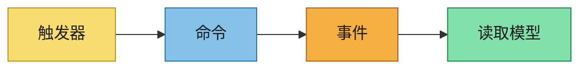
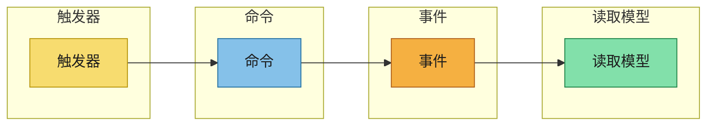

# 事件建模

将事件风暴输出转化为显式的行为流。

每个场景使用以下泳道顺序：
`触发器 -> 命令 -> 事件 -> 读取模型`

## 场景概述
- 场景：
- 业务目标：
- 来自 `event-storming.md` 的引用来源：

## 泳道

### 触发器
- 人工/系统触发器：
- 输入信号：

### 命令
- 命令名称：
- 目标聚合/上下文：
- 验证规则：

### 事件
- 事件名称：
- 事件负载摘要：
- 排序/幂等性说明：

### 读取模型
- 投影或物化视图：
- 消费者：
- 支持的查询/用例：

## Mermaid 流程图

## 时间线 / 泳道图

## 下游产物推导说明
- 规范输入（用户故事和验收标准）：
- 设计输入（消息代理、主题命名、负载格式、安全）：
- AsyncAPI 输入（通道、消息、绑定、Schema）：