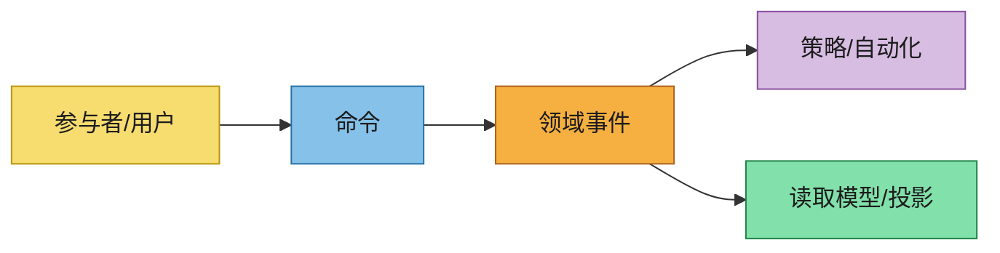

# 事件风暴

在正式规范之前，记录领域内的协作发现成果。

## 范围与目标
- 领域/问题范围：
- 期望的业务成果：
- 在/不在范围内：

## 参与者
- 主要用户：
- 外部系统：
- 自动化代理：

## 领域事件（过去时态）
- 事件：
  - 触发原因：
  - 产生的数据：
  - 业务影响：

## 命令
- 命令：
  - 发出者（参与者/系统）：
  - 聚合/上下文目标：
  - 前置条件：
  - 期望事件：

## 聚合 / 限界上下文
- 聚合/上下文：
  - 职责：
  - 不变量：
  - 所属数据：

## 自动化 / 策略
- 自动化/策略名称：
  - 触发事件：
  - 发出的命令：
  - 失败处理：

## 时间线图（Mermaid）

## 热点与待解决问题
- 模糊点：
- 风险：
- 需要决策：

## 交付至下游产物
总结这些发现如何影响以下内容：
- `event-modeling.md`
- `specs/**/*.md`
- `design.md`
- `asyncapi.yaml`